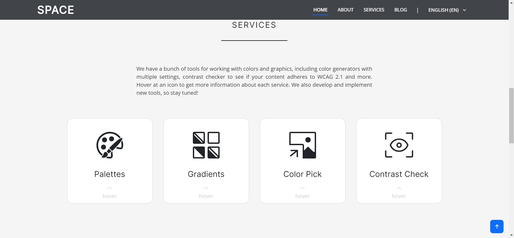

# SPACE PROJECT

__SPACE__ – Web-приложение на Django, предоставляющее полезные инструменты для упрощения и ускорения разработки графического контента.
Бек-энд написан на Django, фронт-энд - HTML/CSS/JS + Bootstrap. Проект предоставляет следующие возможности и функции:
* 4 инструмента для работы с цветами:
  * Генератор палитр с гибкими настройками (цветовые режимы для дальтоников, фильтр яркости, средство проверки контраста);
  * Генератор градиентов (линейных, радиальных);
  * Выделение наиболее часто встречающихся цветов с загружаемого изображения (кластерный анализ);
  * Валидатор соответствия цветов правилам WCAG.
* Поддержка экспорта результатов в различных форматах (CSS, CSV, JSON, коллажи в формате PDF, PNG, JPEG);
* Система блога (гибкий поиск по постам. выставление рейтинга для постов, комментирование);
* Адаптивный дизайн для мобильных устройств;
* Поддержка разных языков (русский и английский).

## Установка проекта на компьютер
Для установки проекта на свой компьютер необходимо выполнить следующие действия:
* Скачать и установить Python версии не ниже 3.8 с [официального сайта](https://www.python.org/)
* Скопировать репозиторий к себе на компьютер
* Открыть терминал, перейти в корневую папку скопированного репозитория и ввести команду:
```
pip install -r requirements.txt
```

Данная команда установит все необходимые библиотеки и зависимости для проекта.
  
## Запуск проекта

* Перед запуском проекта необходимо сгенерировать секретный ключ для Django. Для этого можно воспользоваться сервисом [Djecrety](https://djecrety.ir/). Перейдите на сайт, сгенерируйте ключ и скопируйте его;
* Откройте корневую папку проекта, перейдите в папку `space`. Откройте файл `.env` любым текстовым редактором. В первой строчке, `SECRET_KEY=`, после знака равно вставьте сгенерированный ранее ключ. Сохраните изменения;
* Откройте терминал, в терминале перейдите в корневую папку проекта, далее в папку `space`. Введите команду:
```
python manage.py runserver
```
После этой команды сервер запустится по адресу `127.0.0.1:8000`. Откройте этот адрес в любом браузере.

## Изображения

Главная страница: блок приветствия


Главная страница: блок инструментов


Главная страница: блок статей


Инструмент: Генератор палитр


Инструмент: Генератор градиентов


Инструмент: Извлечение основных цветов из изображения


Инструмент: Проверка контрастности


Блог: страница статьи


## Контакты
Если вы хотите помочь в разработке или у вас есть вопросы, вы можете связаться с создателем репозитория ([@rand0lphc](https://t.me/rand0lphc)) в telegram.
